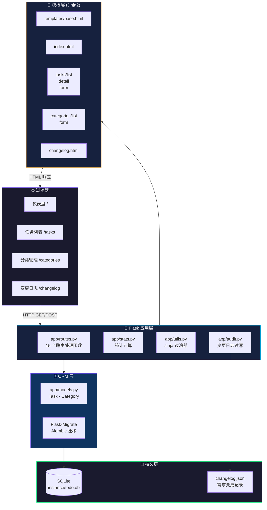
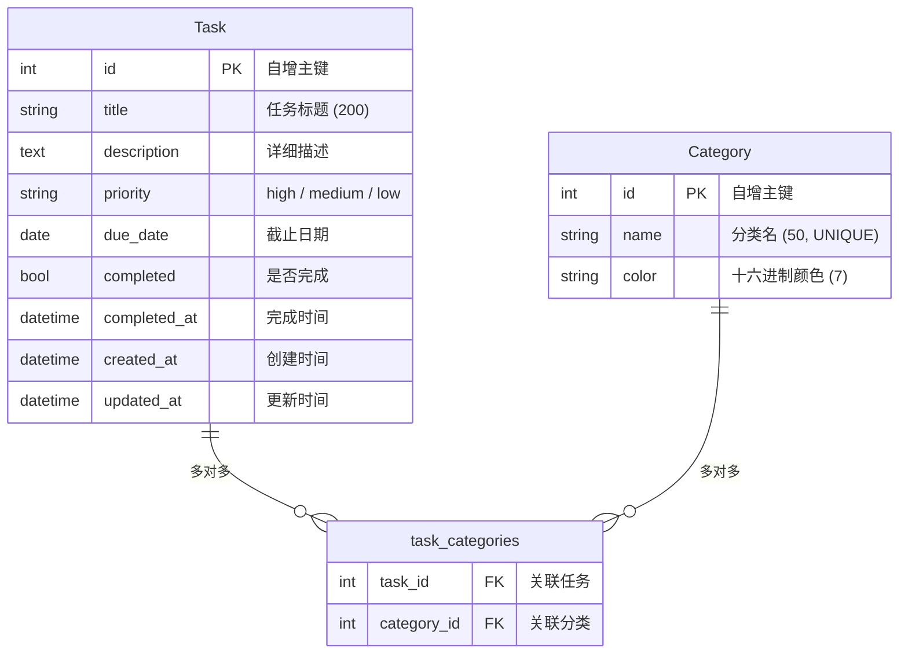
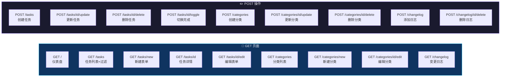
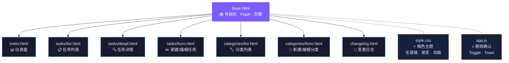
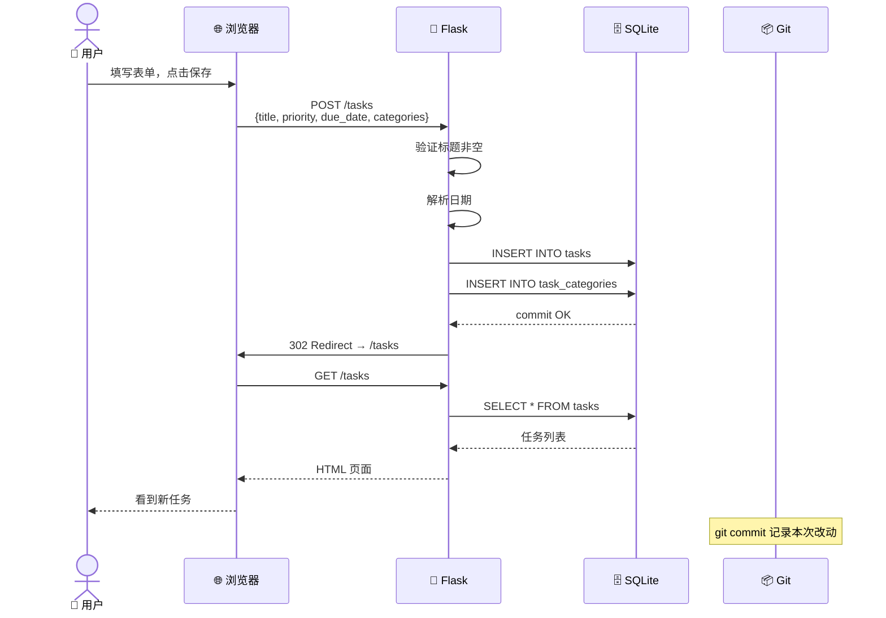
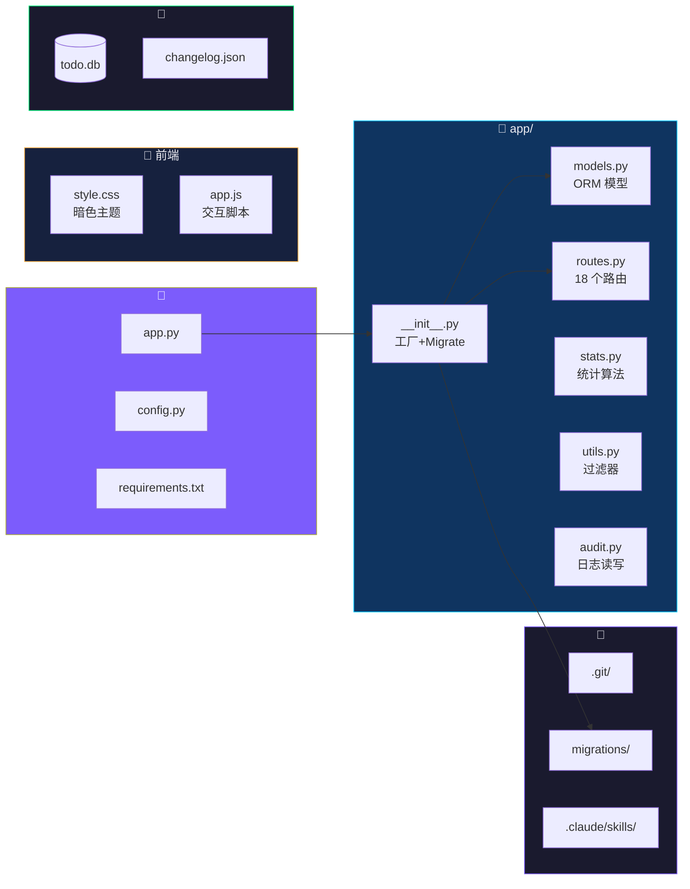

# TaskFlow 架构文档

> 生成于 2026-07-08 · [Mermaid 图表](https://mermaid.js.org)

---

## 1. 系统架构总览

```mermaid
graph TB
    subgraph 浏览器["🌐 浏览器"]
        DASH[仪表盘 /]
        TASKS[任务列表 /tasks]
        CATS[分类管理 /categories]
        LOG[变更日志 /changelog]
    end

    subgraph FLASK["🐍 Flask 应用层"]
        ROUTE[app/routes.py<br/>15 个路由处理函数]
        STATS[app/stats.py<br/>统计计算]
        UTILS[app/utils.py<br/>Jinja 过滤器]
        AUDIT[app/audit.py<br/>变更日志读写]
    end

    subgraph ORM["🗄️ ORM 层"]
        MODELS[app/models.py<br/>Task · Category]
        MIGRATE[Flask-Migrate<br/>Alembic 迁移]
    end

    subgraph STORAGE["💾 持久层"]
        SQLITE[(SQLite<br/>instance/todo.db)]
        JSON[changelog.json<br/>需求变更记录]
    end

    subgraph TEMPLATES["🎨 模板层 (Jinja2)"]
        BASE[templates/base.html]
        INDEX[index.html]
        TASK_F[tasks/list<br/>detail<br/>form]
        CAT_F[categories/list<br/>form]
        CHANGELOG[changelog.html]
    end

    浏览器 -->|HTTP GET/POST| FLASK
    FLASK --> ORM
    ORM --> SQLITE
    AUDIT --> JSON
    FLASK --> TEMPLATES
    TEMPLATES -->|HTML 响应| 浏览器

    style 浏览器 fill:#1a1a2e,stroke:#7C5CFC,color:#EAEAF0
    style FLASK fill:#16213e,stroke:#00C6FF,color:#EAEAF0
    style ORM fill:#0f3460,stroke:#7C5CFC,color:#EAEAF0
    style STORAGE fill:#1a1a2e,stroke:#00E676,color:#EAEAF0
    style TEMPLATES fill:#16213e,stroke:#FFB74D,color:#EAEAF0
```

## 2. 数据库 ER 图

```mermaid
erDiagram
    Task ||--o{ task_categories : "多对多"
    Category ||--o{ task_categories : "多对多"

    Task {
        int id PK "自增主键"
        string title "任务标题 (200)"
        text description "详细描述"
        string priority "high / medium / low"
        date due_date "截止日期"
        bool completed "是否完成"
        datetime completed_at "完成时间"
        datetime created_at "创建时间"
        datetime updated_at "更新时间"
    }

    Category {
        int id PK "自增主键"
        string name "分类名 (50, UNIQUE)"
        string color "十六进制颜色 (7)"
    }

    task_categories {
        int task_id FK "关联任务"
        int category_id FK "关联分类"
    }
```

## 3. 路由地图

```mermaid
graph LR
    subgraph 页面路由["📄 GET 页面"]
        R_INDEX[GET /<br/>仪表盘]
        R_TASKS[GET /tasks<br/>任务列表+过滤]
        R_TASK_NEW[GET /tasks/new<br/>新建表单]
        R_TASK_DETAIL[GET /tasks/id<br/>任务详情]
        R_TASK_EDIT[GET /tasks/id/edit<br/>编辑表单]
        R_CATS[GET /categories<br/>分类列表]
        R_CAT_NEW[GET /categories/new<br/>新建分类]
        R_CAT_EDIT[GET /categories/id/edit<br/>编辑分类]
        R_LOG[GET /changelog<br/>变更日志]
    end

    subgraph 操作路由["✏️ POST 操作"]
        R_TASK_CREATE[POST /tasks<br/>创建任务]
        R_TASK_UPDATE[POST /tasks/id/update<br/>更新任务]
        R_TASK_DELETE[POST /tasks/id/delete<br/>删除任务]
        R_TASK_TOGGLE[POST /tasks/id/toggle<br/>切换完成]
        R_CAT_CREATE[POST /categories<br/>创建分类]
        R_CAT_UPDATE[POST /categories/id/update<br/>更新分类]
        R_CAT_DELETE[POST /categories/id/delete<br/>删除分类]
        R_LOG_ADD[POST /changelog<br/>添加日志]
        R_LOG_DEL[POST /changelog/id/delete<br/>删除日志]
    end

    style 页面路由 fill:#0f3460,stroke:#00C6FF,color:#EAEAF0
    style 操作路由 fill:#1a1a2e,stroke:#7C5CFC,color:#EAEAF0
```

## 4. 模板继承树

```mermaid
graph TD
    BASE["base.html<br/>🟣 导航栏 · Flash · 页脚"] --> INDEX["index.html<br/>📊 仪表盘"]
    BASE --> TASK_LIST["tasks/list.html<br/>📋 任务列表"]
    BASE --> TASK_DETAIL["tasks/detail.html<br/>🔍 任务详情"]
    BASE --> TASK_FORM["tasks/form.html<br/>✏️ 新建/编辑任务"]
    BASE --> CAT_LIST["categories/list.html<br/>🏷️ 分类列表"]
    BASE --> CAT_FORM["categories/form.html<br/>🎨 新建/编辑分类"]
    BASE --> CHANGELOG["changelog.html<br/>📝 变更日志"]

    BASE -.- CSS["style.css<br/>⚡ 暗色主题<br/>毛玻璃 · 渐变 · 动画"]
    BASE -.- JS["app.js<br/>⚡ 删除确认<br/>Toggle · Toast"]

    style BASE fill:#7C5CFC,color:#fff,stroke:#fff
    style INDEX fill:#1a1a2e,stroke:#00C6FF,color:#EAEAF0
    style TASK_LIST fill:#1a1a2e,stroke:#00C6FF,color:#EAEAF0
    style TASK_DETAIL fill:#1a1a2e,stroke:#00C6FF,color:#EAEAF0
    style TASK_FORM fill:#1a1a2e,stroke:#00C6FF,color:#EAEAF0
    style CAT_LIST fill:#1a1a2e,stroke:#00C6FF,color:#EAEAF0
    style CAT_FORM fill:#1a1a2e,stroke:#00C6FF,color:#EAEAF0
    style CHANGELOG fill:#1a1a2e,stroke:#00C6FF,color:#EAEAF0
    style CSS fill:#16213e,stroke:#FFB74D,color:#EAEAF0
    style JS fill:#16213e,stroke:#FFB74D,color:#EAEAF0
```

## 5. 核心数据流（创建任务）

```mermaid
sequenceDiagram
    actor User as 👤 用户
    participant Browser as 🌐 浏览器
    participant Flask as 🐍 Flask
    participant DB as 🗄️ SQLite
    participant Git as 📦 Git

    User->>Browser: 填写表单，点击保存
    Browser->>Flask: POST /tasks<br/>{title, priority, due_date, categories}
    Flask->>Flask: 验证标题非空
    Flask->>Flask: 解析日期
    Flask->>DB: INSERT INTO tasks
    Flask->>DB: INSERT INTO task_categories
    DB-->>Flask: commit OK
    Flask->>Browser: 302 Redirect → /tasks
    Browser->>Flask: GET /tasks
    Flask->>DB: SELECT * FROM tasks
    DB-->>Flask: 任务列表
    Flask-->>Browser: HTML 页面
    Browser-->>User: 看到新任务
    Note over Git: git commit 记录本次改动
```

## 6. 项目文件地图

```mermaid
graph LR
    subgraph 入口["🚀"]
        APP_PY[app.py]
        CONFIG[config.py]
        REQ[requirements.txt]
    end

    subgraph 核心["🧠 app/"]
        INIT[__init__.py<br/>工厂+Migrate]
        MODELS2[models.py<br/>ORM 模型]
        ROUTES[routes.py<br/>18 个路由]
        STATS2[stats.py<br/>统计算法]
        UTILS2[utils.py<br/>过滤器]
        AUDIT2[audit.py<br/>日志读写]
    end

    subgraph 前端["🎨 前端"]
        CSS2[style.css<br/>暗色主题]
        JS2[app.js<br/>交互脚本]
    end

    subgraph 数据["💾"]
        DB_FILE[(todo.db)]
        LOG_JSON[changelog.json]
    end

    subgraph DevOps["🔧"]
        GIT[.git/]
        MIGRATIONS[migrations/]
        SKILLS[.claude/skills/]
    end

    APP_PY --> INIT
    INIT --> MODELS2
    INIT --> ROUTES
    INIT --> MIGRATIONS

    style 入口 fill:#7C5CFC,color:#fff
    style 核心 fill:#0f3460,stroke:#00C6FF,color:#EAEAF0
    style 前端 fill:#16213e,stroke:#FFB74D,color:#EAEAF0
    style 数据 fill:#1a1a2e,stroke:#00E676,color:#EAEAF0
    style DevOps fill:#1a1a2e,stroke:#7C5CFC,color:#EAEAF0
```
